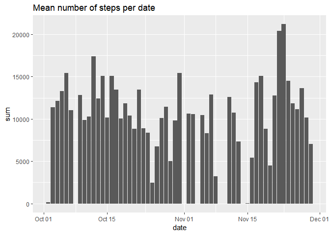
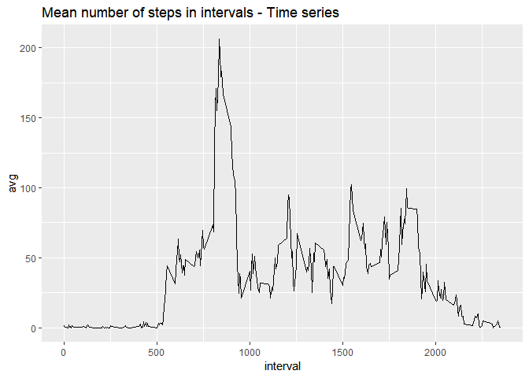
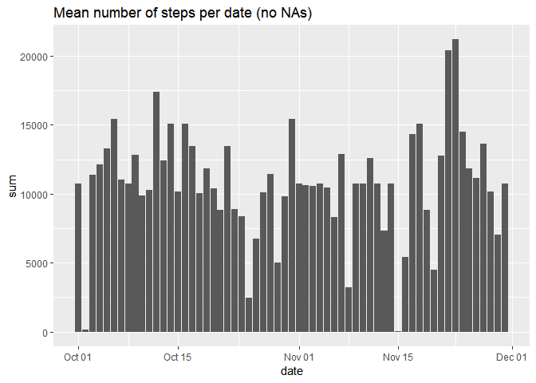
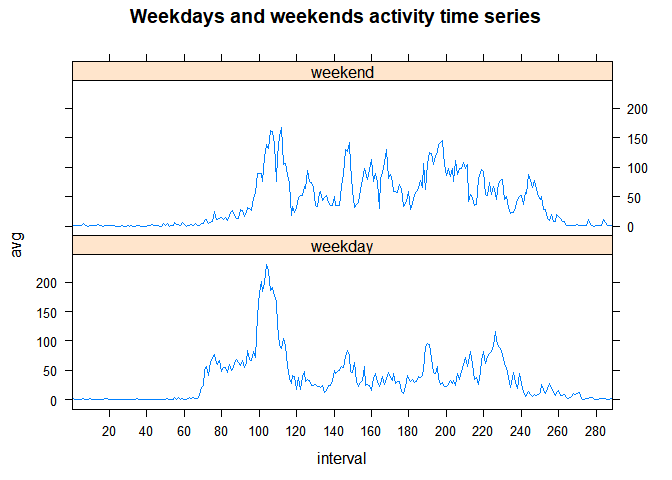

# Peer-Graded Assignment: Course Project 1

### Part one: Reading data

The code chunk below loads all the necessary libraries and reads the data from an URL and transforms it to a usable data frame.


```r
library(dplyr)
library(knitr)
library(ggplot2)
library(lattice)
Sys.setlocale("LC_ALL", "English")

download.file("https://d396qusza40orc.cloudfront.net/repdata%2Fdata%2Factivity.zip", "activity.zip")

unzip("activity.zip")

data <- read.csv("activity.csv")

data$date <- as.Date(data$date)
```

### Part two: What is mean total number of steps taken per day?


```r
steps_in_day <- data %>% 
      group_by(date) %>% 
      summarise(sum = sum(steps))

{qplot(data = steps_in_day, date, sum, 
       geom = "col", 
       main = "Mean number of steps per date")}
```

```
## Warning: Removed 8 rows containing missing values (position_stack).
```

<!-- -->

```r
mean_steps_in_day <- mean(steps_in_day$sum, na.rm = TRUE)
mean_steps_in_day
```

```
## [1] 10766.19
```

```r
median_steps_in_day <- median(steps_in_day$sum, na.rm = TRUE)
median_steps_in_day
```

```
## [1] 10765
```

The mean and median number of steps taken is a day is 1.0766189\times 10^{4} and 10765, respectively. Graph 1 shows total number of steps taken in every day. Notice the 8 dates missing all data.

### Part three: What is the average daily activity pattern?


```r
steps_in_interval <- data %>% 
                        group_by(interval) %>% 
                        summarise(avg = mean(steps, na.rm = TRUE))

{qplot(data = steps_in_interval, interval, avg, 
       geom = "line", 
       main = "Mean number of steps in intervals - Time series")}
```

<!-- -->

```r
max_avg_interval <- with(steps_in_interval, interval[which(avg == max(avg))])
max_avg_interval
```

```
## [1] 835
```

In part three we looked at the average daily activity by calculating the mean number of steps in specific intevals seen on Graph 2. The time interval with the highest average number of steps taken is interval 835.


### Part four: Imputing missing values


```r
num_NA <- sum(is.na(data$steps))
num_NA
```

```
## [1] 2304
```

```r
data_2 <- data
NA_s <- which(is.na(data_2$steps))

data_2$steps[NA_s] <- {unlist(lapply(data_2$interval[NA_s], function(x) 
                              steps_in_interval$avg[steps_in_interval$interval == x]))}

summary(data_2)
```

```
##      steps             date               interval     
##  Min.   :  0.00   Min.   :2012-10-01   Min.   :   0.0  
##  1st Qu.:  0.00   1st Qu.:2012-10-16   1st Qu.: 588.8  
##  Median :  0.00   Median :2012-10-31   Median :1177.5  
##  Mean   : 37.38   Mean   :2012-10-31   Mean   :1177.5  
##  3rd Qu.: 27.00   3rd Qu.:2012-11-15   3rd Qu.:1766.2  
##  Max.   :806.00   Max.   :2012-11-30   Max.   :2355.0
```

The total number of NAs in our data set was 2304. The strategy to impute missing values used was calculating the average number of steps in a specific interval. The summary shows we successfully imputed all NAs.

Now we calculate the total number of steps in every day again and plot it.


```r
steps_in_day_2 <- data_2 %>% 
      group_by(date) %>% 
      summarise(sum = sum(steps))

{qplot(data = steps_in_day_2, date, sum, 
      geom = "col",
      main = "Mean number of steps per date (no NAs)")}
```

<!-- -->

```r
mean_steps_in_day_2 <- mean(steps_in_day_2$sum, na.rm = TRUE)
mean_steps_in_day_2
```

```
## [1] 10766.19
```

```r
median_steps_in_day_2 <- median(steps_in_day_2$sum, na.rm = TRUE)
median_steps_in_day_2
```

```
## [1] 10766.19
```

We see that there is no longer any difference between the mean and the median. 
If the data is missing, it is missing for the whole day, so when we introduce means for intervals we basically say that day was an average day which has no impact on the mean. 

If would have a large impact on the total number of steps taken.

### Part five: Are there differences in activity patterns between weekdays and weekends?

The code chunk below makes a factor between weekdays and weekends. With that we can show a difference in activity with a time series.


```r
data_2$weekday <- ifelse(weekdays(data_2$date) %in% c("Saturday", "Sunday"), "weekend", "weekday")

data_2$interval <- as.factor(data_2$interval)

steps_in_weekday <- data_2 %>% 
                        group_by(interval, weekday) %>% 
                        summarise(avg = mean(steps))

at <- seq(0, 300, 20)

{xyplot(data = steps_in_weekday, avg  ~ interval | weekday, 
        layout = c(1, 2), 
        type = "l", 
        scales = list(x = list(at = at, labels = at)),
        main = "Weekdays and weekends activity time series")}
```

<!-- -->

